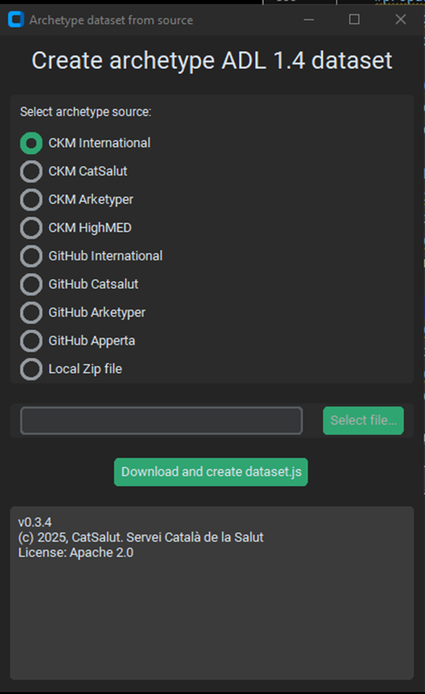

# ADL Extraction Tool

## Overview

The ADL Extraction Tool automates the extraction of key metadata from openEHR archetype files (ADL 1.4), supporting both manual and automated workflows. It can process archetypes from local collections or directly from online sources such as the Clinical Knowledge Manager (CKM). The tool supports both GUI and headless (automation-friendly) modes.

---

<h2>Overview</h2>
  <p>
    The ADL Extraction Tool automates the extraction of key metadata from openEHR archetype files (ADL 1.4), supporting both manual and automated workflows. It can process archetypes from local collections or directly from online sources such as the Clinical Knowledge Manager (CKM). The tool supports both GUI and headless (automation-friendly) modes.
  </p>

  <h2>Requirements and installation</h2>
  <h3>Software Requirements</h3>

  <p>For the use of the source code, the following requirements have to be met:</p>
  
  <ul>
    <li>Python 3.11 (or compatible version)</li>
    <li>Required Python libraries:
      <ul>
        <li>requests</li>
        <li>datetime</li>
        <li>pandas</li>
        <li>customtkinter</li>
      </ul>
      <em>Other libraries such as os, zipfile, re, json, tkinter, shutil, and time are part of the Python standard library.</em>
    </li>
  </ul>

  <p>If the executable file is used, the target machine should be running a compatible version of Windows. The executable created on a specific version of Windows might not work on significantly older versions due to differences in system libraries.</p>

  <h3>Installation</h3>
  <ol>
    <li>Download the last version of the script from the repository:<br>
      <a href="https://github.com/martinkochdesign/openEHR_fellowship_2025_project/blob/main/src/" target="_blank">https://github.com/martinkochdesign/openEHR_fellowship_2025_project/blob/main/src/</a>
    </li>
    <li>Install dependencies (either from your IDE or over pip):
      <pre><code>pip install -r requirements.txt</code></pre>
    </li>
  </ol>

  <p>If you use the executable, you can download the latest compiled version from <a href="https://github.com/martinkochdesign/openEHR_fellowship_2025_project/tree/main/dist" target="_blank">https://github.com/martinkochdesign/openEHR_fellowship_2025_project/tree/main/dist</a>.</p>


## Usage

### A. Running the Tool Manually (GUI Mode)
1. When launching the executable file or the script without headless mode, the GUI of the application opens.




2. Use the graphical interface to select the source of archetypes (local folder, CKM, or GitHub mirror).
3. Start the extraction process with the button "Download and create dataset.js". The tool will process the files and generate an output file with the extracted metadata in the same direction as the executable (or script).

### B. Running in Headless Mode (Automation)
1. Set `headless = True` in the script configuration.
2. Specify the source URL (e.g., CKM REST API endpoint) and other parameters as needed:
   ```python
   headless = True
   URL = 'https://ckm.openehr.org/ckm/retrieveResources?...'
   zipFileName = 'TempZipFile.zip'
   CKMorGitHub = 'CKM'
   provenance = 'CKM International'
   ```
3. Run the script.
4. The tool will run without user interaction and output the results in the same direction as the script.

## Automation with GitHub Actions
The tool can be scheduled to run automatically using GitHub Actions.

Example Workflow (.github/workflows/update-dataset.yml):
```
name: Weekly Archetype Dataset Update
on:
  schedule:
    - cron: '0 3 * * 1'  # Every Monday at 03:00 UTC
  workflow_dispatch:
jobs:
  update-dataset:
    runs-on: ubuntu-latest
    steps:
      - name: Checkout repository
        uses: actions/checkout@v3
      - name: Set up Python
        uses: actions/setup-python@v4
        with:
          python-version: '3.11'
      - name: Install Python dependencies
        run: |
          if [ -f requirements.txt ]; then pip install -r requirements.txt; fi
      - name: Run extractor script
        run: |
          python adl_extraction_tool.py
      - name: Commit and push updated dataset
        run: |
          git config --global user.name "github-actions"
          git config --global user.email "github-actions@github.com"
          git add dataset.js
          git commit -m "Automated weekly dataset update" || echo "No changes to commit"
          git push
```
Adjust the schedule as needed. See https://crontab.guru/ for cron syntax help. Ensure repository Actions permissions are set to "Read and write".

## Output
- The tool generates a single output file dataset.js, containing extracted metadata for each archetype.

- The result file is formatted for integration into a JavaScript code:


```
const provenance = "CKM International";
const extraction_date = "2025-07-16 07:34:54";
const allNodes = [{
        "id": "openEHR-EHR-CLUSTER.dietary_nutrients.v0",
        "archetype_id": "openEHR-EHR-CLUSTER.dietary_nutrients.v0",
        "class": "EHR-CLUSTER",
        "lifecycle_state": "in_development",
        "original_language": "en",
        "date": "2016-12-14",
        "translation_languages": [],
        "purpose": "To record information about the nutrients consumed by an individual for nourishment.",
        "use": "Use to record information about the nutrients consumed by an individual for nourishment.  This archetype has been designed to capture measurements about the consumption of the common groupings of nutrients. Add CLUSTER.macronutrients and CLUSTER.micronutrients into the 'Details' SLOT in a template in order to record consumption measurements for specific nutrients.",
        "keywords": ["nutrients", "diet"],
        "include": [{
                "code": "at0014",
                "label": "Details",
                "type": "CLUSTER",
                "archetypes": ["openEHR-EHR-CLUSTER.micronutrients.v0", "openEHR-EHR-CLUSTER.macronutrients.v0"]
            }
        ],
        ...
```
## Troubleshooting
- Permission errors: Ensure all files are closed before running/deleting outputs.
- Missing dependencies: Double-check your requirements.txt and Python version.
- Automation issues: Verify GitHub Actions permissions and workflow YAML syntax.

## Support & Contributions
For issues, feature requests, or contributions, please use the [https://github.com/martinkochdesign/openEHR_fellowship_2025_project](GitHub - martinkochdesign/openEHR_fellowship_2025_project) issue tracker or submit a pull request.

